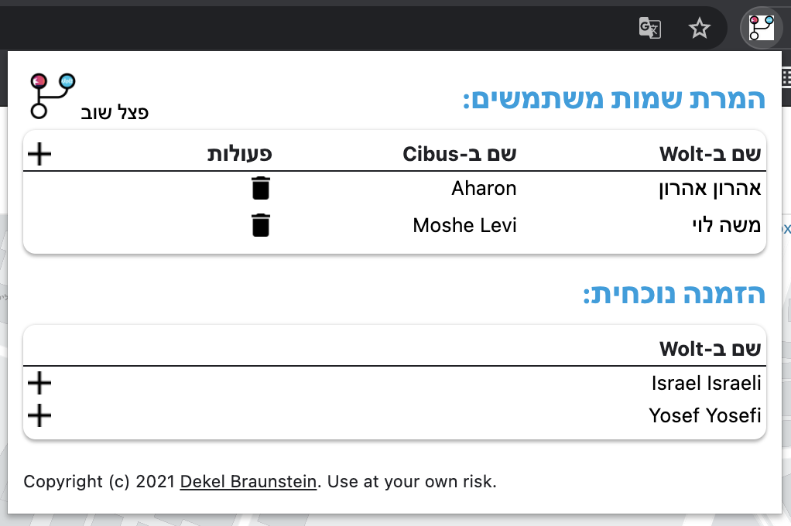

# CibuSplitter

CibuSplitter is a chrome extension intended to split group-order created in wolt to multiple Cibus cards.

 

## Features
1. Shipping price is divided between participant according to each participant's cost.
2. List of friends can be manually added (to convert between Wolt and Cibus display names).