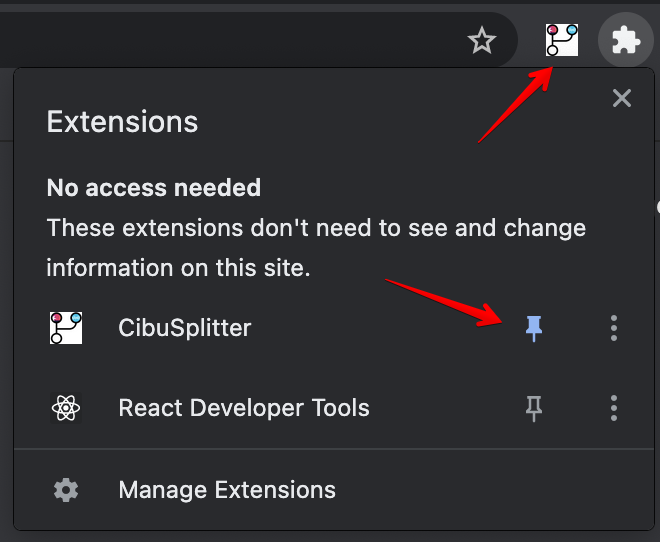

# CibuSplitter

CibuSplitter is a Chrome extension intended to split group-order created in Wolt to multiple Cibus cards.

## Installation
To install the extension please use the Chrome Web Store: https://chrome.google.com/webstore/detail/cibusplitter/lfklmmalkllmjckblbmbcnhinllbhebl?hl=en&authuser=0  
It's recommended to pin the extension to your Chrome's toolbar:

## Features
1. Shipping price is divided between participant according to each participant's cost.
2. List of friends can be manually added (to convert between Wolt and Cibus display names).